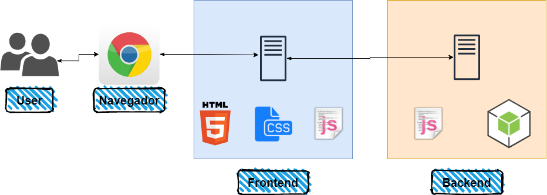

#### Universidad San Carlos de Guatemala
#### Facultad de Ingenieria
#### Escuela de Ciencias y Sistemas
#### Organizacion de Lenguajes y Compiladores 1
#### Ing. Mario Bautista
#### Aux. Jose Puac
#### Aux. Emely Garcia

# Manual Tecnico - Proyecto 2

**Arquitectura Implementada**



Para el proyecto se realizo un frontend y un backend. El frontend fue programado en los lenguajes de html, js y css. Mientras que para el backend se configuro un API Rest en nodejs utilizando la libreria de `express`. El navegador interpretara todo el codigo realizado para la interfaz grafica y esta a su vez hara la peticion al servidor node.

**Herramienta de analisis lexico y sintactico**

Para el analisis lexico y sintactico se utilizo la herramienta Jison.

**Expresiones utilizadas**

Para el reconocimiento de tokens importantes se utilizaron las siguientes expresiones regulares

```jison
[0-9]+"."[0-9]+  
[0-9]+              
[\'\‘\’].[\'\’\‘]                        
[\"\“\”](([^\"\“\”\\])*([\\].)*)*[\"\“\”]
[A-Za-z]([A-Za-z]|[0-9]|"_")* 
```
> La primer expresion `[0-9]+"."[0-9]+` se encarga de reconocer todos los valores decimales.

> La expresion `[0-9]+` se encarga de reconocer todos los valores enteros.

> La expresion `[\'\‘\’].[\'\’\‘]` se encarga de reconocer los caracteres.

> La expresion `[\"\“\”](([^\"\“\”\\])*([\\].)*)*[\"\“\”]` se encarga de reconocer las cadenas.

> La expresion `[A-Za-z]([A-Za-z]|[0-9]|"_")*` se encarga de reconocer los identificadores (variables).

**Clases utilizadas**

De las clases mas importantes que se utilizaron durante el desarrollo del proyecto fueron: 

	- Expresion
	- Instruccion

Ya que para poder realizar la ejecucion todo el codigo se divide en `expresion` (devuelve un valor al ejecutarse) e `instruccion` que a diferencia de una expresion este no devuelve un valor al ejecutarse.

Otra de las clases importantes a mencionar es la clase `Entorno` ya que en ella se manejan las tablas de simbolos por entorno generado.

```javascript
constructor(nombre, padre, global){
        this.tsimbolos = [];
        this.nombre = nombre;
        this.padre = padre;
        if (global === null)
            this.global = this;
        else
            this.global = global;
    }
```
En el constructor de esta clase se reciben 3 parametros, los cuales son:

	- Nombre: Representa el nombre del entorno actual
	- Padre: Hace referencia al entorno padre
	- Global: Hace referencia al entorno global


```javascript
existeSimbolo(nombre){
        for(let i = 0; i < this.tsimbolos.length; i++){
            if (this.tsimbolos[i].nombre.toString().toLowerCase() === nombre.toString().toLowerCase())
                return true;
        }
        if (this.padre === null)
            return false;
        else{
            return this.padre.existeSimbolo(nombre);
        }
    }
```
Este metodo realiza un recorrido en la tabla de simbolos actual para realizar la busqueda de un simbolo existente. Si este simbolo existe retorno un valor `verdadero`, de lo contrario retorna `falso`.

**Gramatica Utilizada**

[Gramatica](./Gramatica_Proyecto2.md)

Proyecto realizado por _Edgar Daniel Cil_ con carnet **201503600**
