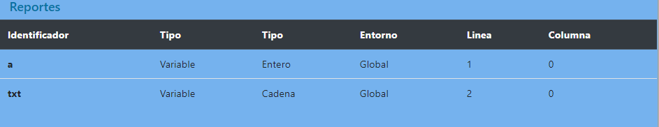

#### Universidad San Carlos de Guatemala
#### Facultad de Ingenieria
#### Escuela de Ciencias y Sistemas
#### Organizacion de Lenguajes y Compiladores 1
#### Ing. Mario Bautista
#### Aux. Jose Puac
#### Aux. Emely Garcia

# Manual de Usuario - Proyecto 2

**Interfaz Grafica**

En la interfaz grafica se muestra una pagina con 2 menu y un boton para poder realizar el analisis de un archivo de entrada. Tambien cuenta con una consola donde se imprimiran los salidas y errores. En la ultima seccion de la pagina se visualizaran los reportes que son explicados mas adelante.

**Menu**

En el primer combobox, apareceran las opciones de:

| Opcion | Funcion |
| :----: | :----: |
| Abrir | Permitira abrir un archivo con extension `.ty` y mostrarlo en una nueva pestana de la interfaz |
| Nuevo | Permitira crear una pestana en blanco |
| Cerrar | Permitira cerrar la pestana actual |
| Guardar | Permitira descargar un archivo con extension `.ty` a su computador, con el contenido de la pestana actual. |
| Guardar como | Permitira descargar un archivo con extension `.ty` a su computador, con el contenido de la pestana actual. |

**Abrir Archivo**

Al dar click en `Menu > Abrir` se habilitara un input con el cual podra seleccionarse el archivo que se desea cargar.

**Nueva Pestana**

Al dar click en `Menu > Nuevo` se creara una pestana nueva con contenido en blanco para realizar la edicion de codigo.

> Nota: Al dar click en `Menu > Cerrar` se cerrara la pestana actual seleccionada y se perdera su contenido.

**Guardar y Guardar como**

Permitira descargar un archivo con extension `.ty` a su computador, con el contenido de la pestana actual.

**Analizar**

Al dar click en el boton `Analizar` se analizara y ejecutara el codigo que se encuentre en la pestana seleccionada. Al terminar de ejecutar mostrara en la consola las salidas y errores que se generan al momento del analisis.

### Reportes

Este boton permitira visualizar los diferentes tipos de reportes generados.

**Reporte de errores**

Para visualizar los errores de una mejor manera, puede dar click en `Menu > Tabla de errores` el cual mostrara una tabla en la seccion de `Reportes`.

**Reporte de Tabla de simbolos**

Para visualizar los simbolos generados durante la ejecucion del codigo, puede dar click en `Menu > Tabla de Simbolos` el cual mostrara una tabla en la seccion de `Reportes`

Proyecto realizado por _Edgar Daniel Cil_ con carnet **201503600**
